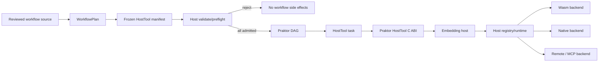
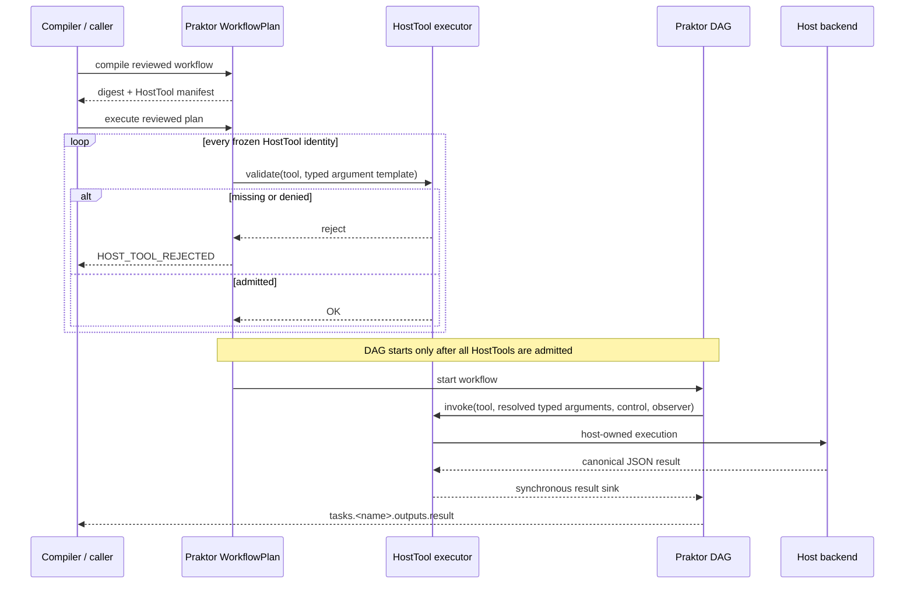

# HostTool execution

Praktor 0.4.4 adds a backend-neutral HostTool runner for reviewed
`WorkflowPlan` execution.

A workflow names a stable host tool identity and supplies a typed argument
object:

```yaml
tasks:
  - name: inspect
    tool: repo.inspect
    with:
      path: "{{ variables.path }}"
      limit: 2
```

Praktor does not resolve that identity to a native library, Wasm module,
remote endpoint, RuntimeTools registry, or plugin. The embedding host owns that
mapping and the authority behind it.

## Architecture



Ownership is intentionally one-way:

- Praktor owns workflow parsing, reviewed plan identity, DAG scheduling,
  cancellation/deadline composition, lifecycle events, and typed task output.
- The embedding host owns tool discovery, capability/effect admission, backend
  selection, and actual tool execution.
- HostTool is not a Wasm runner and does not make Praktor depend on TurboAgent,
  TurboWasm, RuntimeTools, MCP, or Plugin ABI.

## Lifecycle



Unknown or denied HostTools fail during preflight before the workflow starts.
There is no fallback to `command`, `program`, shell, a library path, or a
Wasm path.

## Public C ABI

The HostTool surface is additive in ABI major 2:

- `PRAKTOR_ABI_MINOR >= 5`
- `PRAKTOR_CAPABILITY_HOST_TOOL`
- `praktor_host_tool_executor`
- `praktor_execute_workflow_plan_host_tools()`

The executor has two operations:

1. `validate` — side-effect-free preflight of the frozen tool identity and
   reviewed typed argument template.
2. `invoke` — execution after all plan HostTools have passed preflight.

A successful invocation returns one canonical JSON payload through the
Praktor-owned synchronous result sink. The host owns the source bytes and may
release them immediately after the sink returns; allocator ownership never
crosses the DLL/CRT boundary.

## Execution control and lineage

HostTool invocation receives an execution-control view derived from the
workflow execution:

- cancellation remains connected to the workflow cancellation probe;
- timeout is the **remaining** workflow deadline, not a fresh full timeout;
- observer lineage is forwarded for tracing;
- none of these values are injected into workflow variables.

Nested `uses` workflows inherit the same execution-scoped HostTool authority.

## Effects and harness safety

Praktor can prove only that a task requires host execution. It therefore records
the conservative `host_tool` effect and marks the concrete effects as
host-resolved/unknown.

This is deliberate: a HostTool workflow must not become `harness_safe` merely
because Praktor cannot see whether the embedding backend performs filesystem,
network, process, or external mutations. The embedding compiler/host must
perform capability/effect admission before providing HostTool authority.
